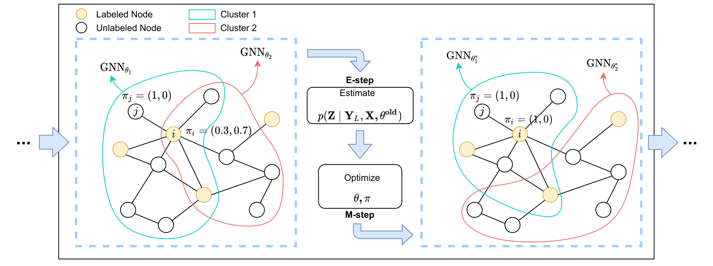

# GraphAdaMix: Enhancing Node Representations with Graph Adaptive Mixtures

<p align="center"></p>

This is the code repository of **AISTATS 2022** paper 'GraphAdaMix: Enhancing Node Representations with Graph Adaptive Mixtures'.
GraphAdaMix is an enhancement technique for GNN-based models.
It aims to improve GNN's representation capacity and performance for semi-supervised or unsupervised graph learning settings.
The information of the corresponding paper is as follows:

> Title: GraphAdaMix: Enhancing Node Representations with Graph Adaptive Mixtures

> Authors: Da Sun Handason Tam, Siyue Xie and Wing Cheong Lau

> Affiliation: The Chinese University of Hong Kong

> Abstract: Graph Neural Networks (GNNs) are the current state-of-the-art models in learning node representations for many predictive tasks on graphs.
> Typically, GNNs reuses the same set of model parameters across all nodes in the graph to improve the training efficiency and exploit the translationally-invariant properties in many datasets.
> However, the parameter sharing scheme prevents GNNs from distinguishing two nodes having the same local structure and that the translation invariance property may not exhibit in real-world graphs.
> In this paper, we present Graph Adaptive Mixtures (GraphAdaMix), a novel approach for learning node representations in a graph by introducing multiple independent GNN models and a trainable mixture distribution for each node.
> GraphAdaMix can adapt to tasks with different settings.
> Specifically, for semi-supervised tasks, we optimize GraphAdaMix using the Expectation-Maximization (EM) algorithm, while in unsupervised settings, GraphAdaMix is trained following the paradigm of contrastive learning.
> We evaluate GraphAdaMix on ten benchmark datasets with extensive experiments.
> GraphAdaMix is demonstrated to consistently boost state-of-the-art GNN variants in semi-supervised and unsupervised node classification tasks.

The formal published version of our paper will be available soon on the AISTATS library.

## Cite This Work
```
@article{tam2022graphadamix,
  title={GraphAdaMix: Enhancing Node Representations with Graph Adaptive Mixtures},
  author={Tam, Da Sun Handason and Xie, Siyue and Lau, Wing Cheong},
  booktitle={Proceedings of the 25th International Conference on Artificial Intelligence and Statistics (AISTATS)},
  year={2022},
}
```

## Requirements
To be updated.

## Instructions
To be updated.

## MLP

## GCN

## GraphSAGE

## GraphSAINT

## SIGN


## BGRL
### WikiCS
bitfusion run -n 1 python bgrl_main.py --dataset wikics --pf1 0.2 --pf2 0.1 --pe1 0.2 --pe2 0.3 --encoder_hidden_dim 512 --prediction_hidden_dim 512 --embedding_dim 256 --lr 5e-4

### Amazon Computers
bitfusion run -n 1 python bgrl_main.py --dataset amazon_computers --pf1 0.2 --pf2 0.1 --pe1 0.5 --pe2 0.4 --encoder_hidden_dim 256 --prediction_hidden_dim 512 --embedding_dim 128 --lr 5e-4

### Amazon Photos
bitfusion run -n 1 python bgrl_main.py --dataset amazon_photo --pf1 0.1 --pf2 0.2 --pe1 0.4 --pe2 0.1 --encoder_hidden_dim 512 --prediction_hidden_dim 512 --embedding_dim 256 --lr 1e-4

### Coauthor CS
bitfusion run -n 1 python bgrl_main.py --dataset coauthor_cs --pf1 0.3 --pf2 0.4 --pe1 0.3 --pe2 0.2 --encoder_hidden_dim 512 --prediction_hidden_dim 512 --embedding_dim 256 --lr 1e-5

### Coauthor Physics
bitfusion run -n 1 python bgrl_main.py --dataset coauthor_physics --pf1 0.1 --pf2 0.4 --pe1 0.4 --pe2 0.1 --encoder_hidden_dim 256 --prediction_hidden_dim 512 --embedding_dim 128 --lr 1e-5
